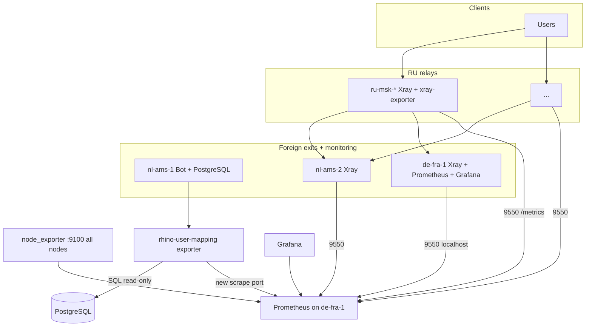

# Grafana monitoring: Telegram-linked traffic, RU inbound aggregates, host metrics

## Task name

Extend Rhino VPN observability so Grafana/Prometheus cover **host health (node_exporter)** on all production nodes, **RU relay user-facing inbound (`vless-in`) traffic** (total and per relay), and **per-user traffic labeled by Telegram user ID** (joined from the bot PostgreSQL database), with panels for both **volume over range** and **instantaneous throughput**.

## Context and motivation

Operations need to correlate Xray stats with **real subscribers** (Telegram IDs), not only opaque `target` emails. They also need a clear view of **load on the client-facing inbound** across RU relays and baseline **OS/host metrics** everywhere Xray or the monitoring stack runs. The existing stack (Prometheus on `de-fra-1`, xray-exporter on nodes, bundled xray-exporter dashboard) is the foundation; this work extends it without changing the two-level RU → foreign topology.

## Global goal

After implementation, an operator can:

1. See **CPU, memory, disk, network** (and other node_exporter signals) for every host aligned with `configs/production/vars/servers.yml` / inventory.
2. See **total** and **per-ru-relay** bytes/rates for the inbound tagged **`xray_inbound_tag`** (default `vless-in`) on **`role="ru-relay"`** targets only.
3. See **per-subscriber traffic** (and aggregates by Telegram user) using **Telegram ID** as the primary human-facing label, with both **`increase()` / range totals** and **`rate` / `irate`** views.

## Architectural brief

| Area | Approach |
|------|----------|
| Host metrics | **node_exporter** on each VPN/monitoring node, scraped by Prometheus from `de-fra-1`, **UFW** allowing the scrape port only from `vault_de_fra_1_ip` (same pattern as xray-exporter `:9550`). |
| RU `vless-in` aggregates | Use existing **xray-exporter** counters `xray_traffic_{uplink,downlink}_bytes_total` with `dimension="inbound"` and `target="<xray_inbound_tag>"`, filtered with `role="ru-relay"` (and optionally `server` label from Prometheus). No new exporter required for this slice. |
| Telegram ID join | **Chosen design: dedicated read-only exporter on the `telegram_bot` host** (default `nl-ams-1`) that connects to the **existing PostgreSQL** (Docker network), reads `subscriptions` + `users`, and exposes a **1-valued gauge** (or info-style series) mapping Xray **user email** → **`telegram_id`**, including **legacy** email forms still present in Xray. Prometheus scrapes this job from `de-fra-1`; UFW on the bot host allows only the Prometheus server IP. **Rationale:** avoids opening PostgreSQL to Frankfurt, keeps mapping authoritative with the bot schema, and works for legacy clients where the email does not embed `telegram_id`. **Rejected for primary use:** Prometheus-only `label_replace` on `sub_<id>_...@rhino` (incomplete for `sub-<uuid>@rhino`), and static recording rules (mapping is dynamic). |

## Architecture diagram

## Sub-tasks (table of contents)

| # | Document | Summary | Depends on |
|---|----------|---------|------------|
| 01 | [01_node_exporter_deployment.md](01_node_exporter_deployment.md) | Deploy node_exporter on all inventory VPN nodes + monitoring host; vars/images/paths. | — |
| 02 | [02_prometheus_scrape_ufw_node.md](02_prometheus_scrape_ufw_node.md) | UFW `:9100` from Prometheus host; Prometheus `job_name` for node; reload monitoring stack. | 01 |
| 03 | [03_ru_vless_in_aggregates.md](03_ru_vless_in_aggregates.md) | PromQL + dashboard panels: total + per-relay for `xray_inbound_tag` on RU only; volume + rate. | — (metrics already from xray-exporter) |
| 04 | [04_telegram_id_mapping_exporter.md](04_telegram_id_mapping_exporter.md) | Mapping exporter on `telegram_bot` host, DB access, metric shape, scrape + UFW. | — |
| 05 | [05_grafana_dashboards_host_and_traffic.md](05_grafana_dashboards_host_and_traffic.md) | New/updated dashboards: hosts; traffic by Telegram ID via `* on(target) group_left(telegram_id)`; dual visualization. | 01, 02, 03, 04 |
| 06 | [06_docs_monitoring_update.md](06_docs_monitoring_update.md) | Update `docs/05-monitoring.md` (and pointers in arch doc if needed). | 05 (content stable) |

**Suggested parallel work:** 01 + 03 + 04 can proceed in parallel; 02 after 01; 05 after 02 and 04 (and ideally 03); 06 last.

## Definition of done (whole project)

- All hosts in `ru_relays` and `foreign_exits` (per `inventories/production/hosts.yml`, consistent with `configs/production/vars/servers.yml`) expose **node_exporter** and appear **UP** in Prometheus.
- Prometheus on `de-fra-1` scrapes **node**, **xray**, and **user-mapping** jobs without manual edits per server beyond Ansible vars.
- Grafana provides dashboards (or clearly separated rows/panels) for **host health**, **RU `vless-in` totals/split**, and **per-Telegram-ID traffic** with both **range volume** and **throughput** views.
- **UFW** rules follow least privilege (scrape ports only from `vault_de_fra_1_ip`, plus any required localhost rule mirroring xray-exporter on `de-fra-1`).
- **`docs/05-monitoring.md`** describes new components, ports, deploy order, and troubleshooting.
- No secrets (DB password, tokens) committed; connection strings remain in Vault / existing bot env patterns.
